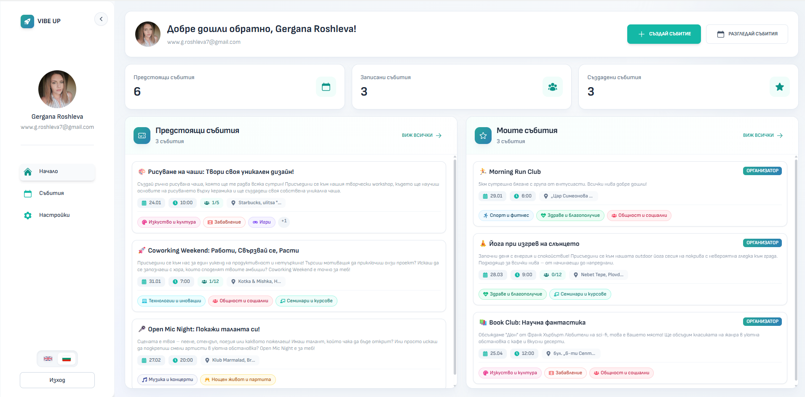
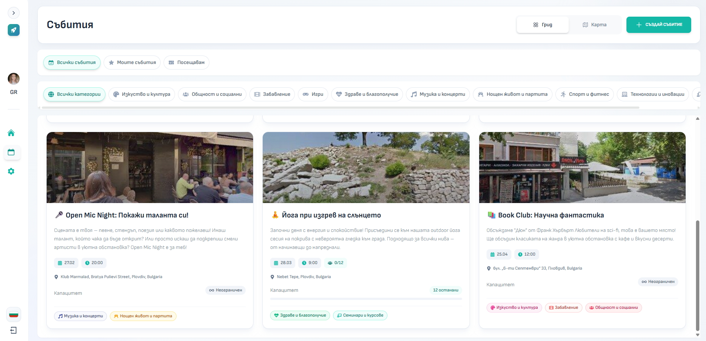
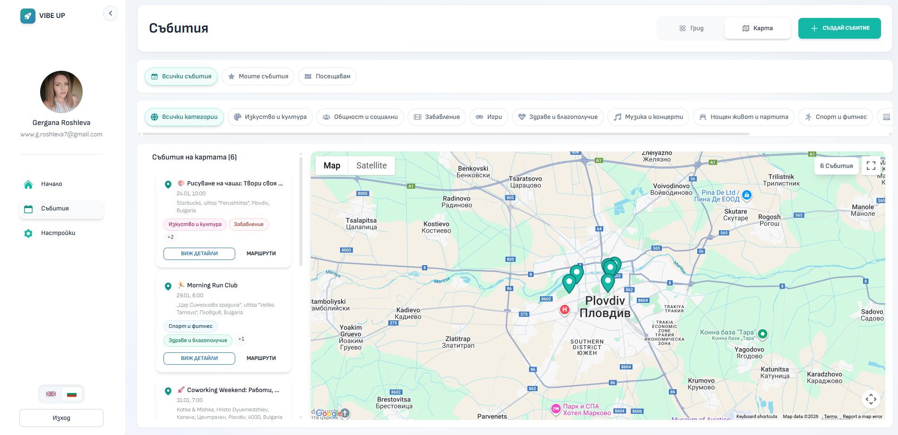
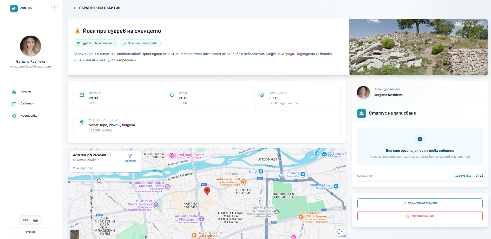
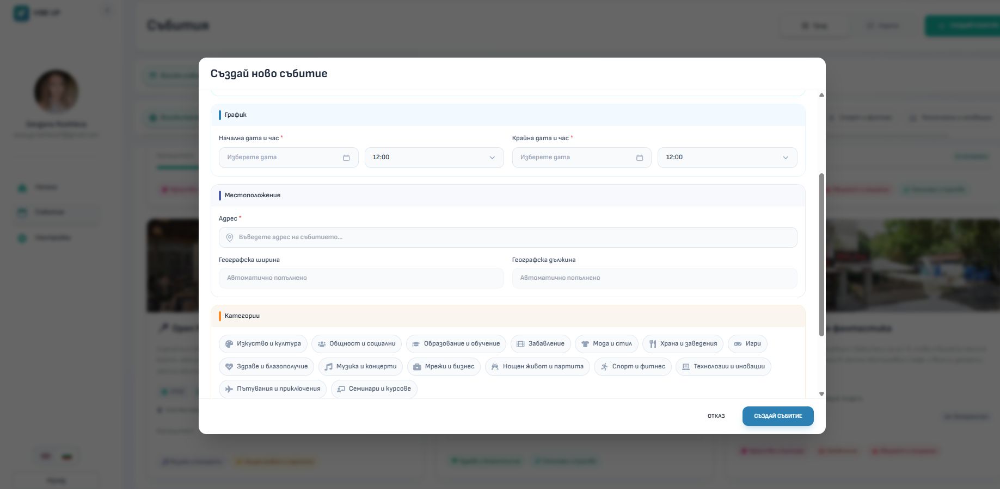
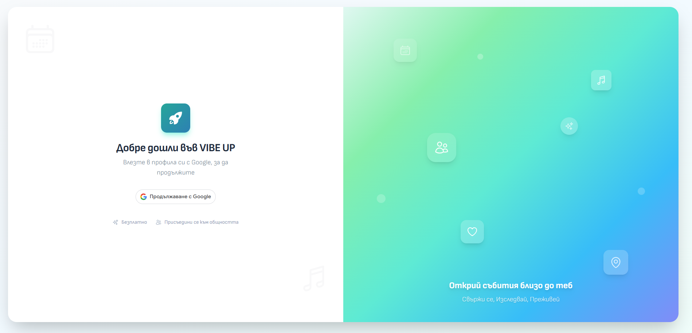

# VibeUp - Event Discovery & Management Platform

## 🚀 Overview

**VibeUp** is a modern, responsive web application designed to help users discover, host, and manage local events. Built with a "Mobile-First" philosophy, it offers a seamless experience across desktop and mobile devices, featuring interactive maps, real-time filtering, and social engagement tools.

This project demonstrates a full-stack implementation with a focus on **Clean Architecture**, **Responsive UX**, and **Modern React Patterns**.

## 🌐 Live Demo

- **Frontend**: [vibeup-frontend.vercel.app](https://vibeup-frontend.vercel.app)
- **Backend API**: [vibeup-backend.onrender.com](https://vibeup-backend.onrender.com)

---

## 📸 Screenshots

| Dashboard                                 | All Events                                  | Map View                                |
| ----------------------------------------- | ------------------------------------------- | --------------------------------------- |
|  |  |  |

| Event Details                                          | Create Event                                    | Login                                  |
| ------------------------------------------------------ | ----------------------------------------------- | -------------------------------------- |
|  |  |  |

---

## ✨ Key Features

- **📱 Hybrid Responsive Design**: Desktop split-screen + mobile-optimized experience
- **🗺️ Google Street View**: Immersive venue preview for every location
- **📍 Smart Address Autocomplete**: Google Places API for accurate address search
- **🌍 Interactive Map**: Custom markers and dynamic clustering
- **🎉 Event Management**: Create, RSVP, and manage events
- **🔐 Google OAuth 2.0**: Secure one-tap sign-in
- **🌐 i18n Support**: English & Bulgarian with auto-detection

---

## 🛠️ Tech Stack

- **Framework**: React 19 + Vite
- **Language**: TypeScript (strict mode)
- **State**: Redux Toolkit
- **Styling**: Tailwind CSS + Material Tailwind + Framer Motion
- **Maps**: @react-google-maps/api
- **Routing**: React Router v7
- **i18n**: i18next

---

## 🎨 Design Patterns

- **Feature-Based Architecture**: Organized by feature modules (`/features/event`, `/features/auth`)
- **Custom Hooks**: Reusable logic (`useGetEvent`, `useRsvp`, `useDateFormatter`)
- **Component Composition**: Compound components for complex UI
- **Container/Presentational**: Separation of logic and UI
- **Redux Ducks Pattern**: Modular state slices

---

## 🔮 Future Enhancements

- **👥 Co-hosts**: Shared event management
- **📍 Saved Places**: Favorite venues for quick creation
- **✅ Verified Hosts**: Trust badges for organizers
- **💬 Event Chat**: Real-time messaging
- **🎟️ Ticketing**: Stripe payment integration
- **🤖 Smart Recommendations**: AI-driven suggestions

---

## 👤 Author

Built by **[Gergana Roshleva](https://github.com/GerganaR)**

---
